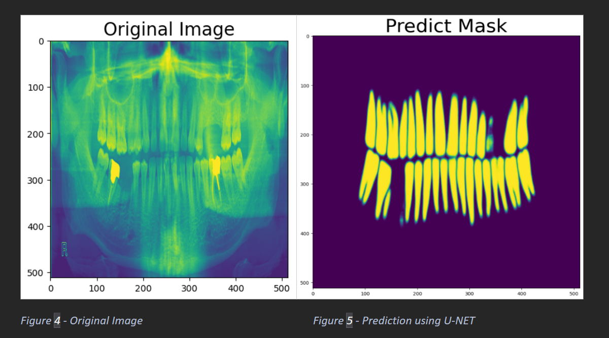
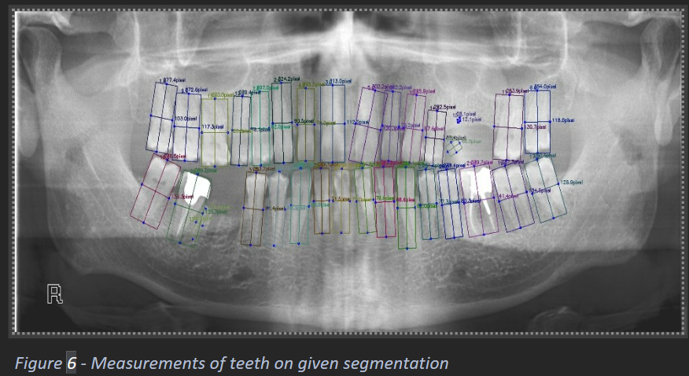
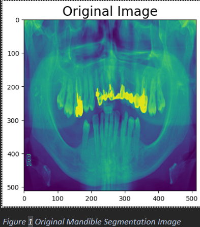
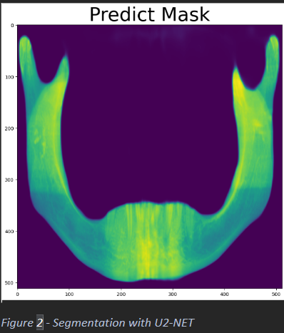

# This is an app meant to integrate the dental imaging models developed for my bachelor's thesis

### The following are some of the image processing results of this work. For more details, check out the thesis folder, where the research process is described (still a work in progress).

    
    

